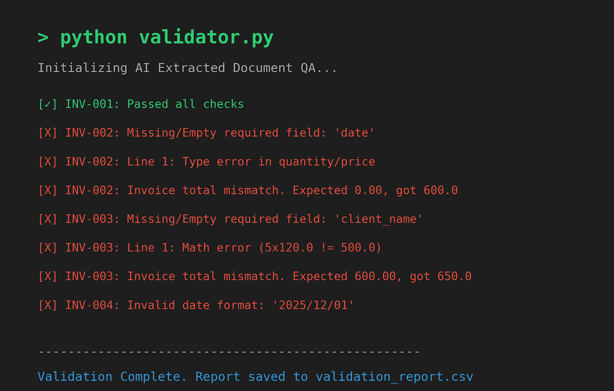

# AI Document Extraction QA & Annotation Validator

## Overview
A lightweight validation pipeline built to mirror enterprise document annotation workflows. This script simulates the review of AI-extracted JSON against source documents by performing field-by-field validation, verifying the mathematical accuracy of line-item totals, and flagging schema/type discrepancies for manual correction.

## Validation Checks (Mapped to Role Requirements)
- **JSON Schema & Field Compliance:** Flags missing, null, or empty required fields.
- **Data Type Enforcement:** Catches string/numeric mismatches (e.g., `"quantity": "eight"` instead of `8`).
- **Mathematical Accuracy:** Verifies `quantity × unit_price == line_total` with float tolerance.
- **Invoice Reconciliation:** Cross-checks line-item sums against `invoice_total`.
- **Error Logging:** Outputs a structured, annotation-ready CSV (`validation_report.csv`) for rapid review and escalation.

## Tech Stack
- **Language:** Python 3.x 
- **Libraries:** Standard libraries only (`json`, `csv`, `datetime`)
- **Architecture:** Zero external dependencies → easily reproducible & lightweight.

## How to Run
1. Ensure `ai_extracted_data.json` and `validator.py` are in the same directory.
2. Run the script: `python validator.py`
3. Review `validation_report.csv` for field-level error logs.

## Why This Matters for Document Annotation
This project demonstrates a working understanding of:
- How AI extraction pipelines fail in production.
- The exact validation steps needed before human-in-the-loop annotation.
- How to systematically document edge cases, math errors, and schema mismatches.
- Translating manual QA workflows into repeatable, auditable programmatic processes.
